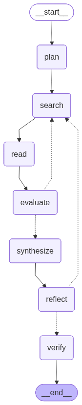

# Autonomous Research Assistant

A LangGraph agent that turns a research question into a structured, cited briefing — and shows its work while doing it. Given a question worth 20–30 minutes of human research, it plans sub-questions, runs iterative web searches, reads full pages, synthesizes a briefing with inline citations, reflects on whether the original question was actually answered, and verifies every claim against the evidence it collected.

## What it demonstrates

- **Explicit planning** — before any search, the question is decomposed into 3–5 independently searchable sub-questions, each with a stated rationale. The plan is load-bearing: it is the search agenda, the grading rubric, the briefing outline, and the self-correction surface.
- **Iterative search** — the first query per sub-question is free (the sub-question text itself); when the evidence is judged insufficient, the agent refines the query and retries up to a hard cap, then moves on with the weakness disclosed rather than hidden.
- **Real source reading** — promising results are rendered in headless Chromium and stripped to clean article text (Playwright + trafilatura), behind a never-raises fallback chain: rendered page, then the search API's extraction, then the snippet. Every source is labeled with which rung produced it.
- **Grounded synthesis** — the briefing is written only from compressed, quote-bearing findings; every factual claim carries an inline [S#] citation into a global source registry.
- **Reflection** — the draft is graded against the original question; material gaps become new sub-questions that re-enter the ordinary research loop. Unfixable gaps are disclosed in the final output, never dropped.
- **Hallucination guardrail** — a deterministic citation check (every [S#] must resolve; substantial passages must be cited) plus an LLM audit of each claim against the findings. Failures are marked `[unverified]` and listed in a Limitations section: flagged, not silently fixed.

## How it works

Seven named nodes, two conditional routers, three loops — every loop capped in `agent/config.py`, so the worst case (~21 searches, ~25 LLM calls) is known before a run starts:

Control flow lives in state (`sub_questions`, `cursor`, `attempts`), which is what makes the run streamable: the CLI and the Streamlit UI are both thin dispatches over the same `stream_mode=["updates", "messages"]` event stream. Design details and the reasoning behind each decision: [architecture.md](architecture.md). Build history with per-phase reports: [project_spec.md](project_spec.md) and [reports/](reports/).

## Example run

    Question: How are EdTech companies using AI agents in their products right now?
    Planned 4 sub-questions:
       1. What are the primary categories of AI agent applications currently being deployed in the EdTech sector?
          why: Establishing a taxonomy of AI agent use cases is necessary to understand the breadth and scope of current industry adoption.
       ...
    Search #1: "What are the primary categories of AI agent applications currently being deployed in the EdTech sector?" -> 5 results
    Read [S1] Agentic AI in Education: Use Cases, 2026 Trends, Playbook (https://...) via playwright
    Read [S2] 7 best agentic AI platforms in 2026 | Market guide (https://...) via playwright
    Sub-question 1/4 answered
    ------------------------------
    Search #2: "Which major EdTech companies have integrated AI agents..." -> 5 results
    ...
    Insufficient, refining: "list of major EdTech companies using AI agents and their specific features"
    Search #3: "list of major EdTech companies using AI agents and their specific features" -> 5 results
    ...
    Briefing
    ------------------------------------------------------------
    ## Executive summary
    EdTech companies are actively deploying AI agents across a range of products to
    personalize learning, automate administrative tasks, ... [S1]
    ...
    ## Limitations
    - Flagged: [S1] does not fully support: "These agents currently provide...
      predictive interventions for student retention" — partial
    - Flagged: [S9] does not fully support: "...a strong emphasis on...
      pedagogical efficacy" — unsupported

That Limitations section is the guardrail working, not failing — over-claims relative to the collected evidence get caught and disclosed instead of shipped as fact.

## Setup

    python3 -m venv .venv
    .venv/bin/pip install -r requirements.txt
    .venv/bin/python -m playwright install chromium
    cp .env.example .env    # add GOOGLE_API_KEY (Google AI Studio) and TAVILY_API_KEY

## Usage

    .venv/bin/python cli.py "your research question"    # dev runner; full log lands in runs/
    .venv/bin/streamlit run app.py                      # web UI with the live timeline

| Knob (env) | Effect |
|---|---|
| `GEMINI_MODEL` / `GEMINI_SMART_MODEL` | model tiers: plumbing calls / the synthesis call |
| `CACHE=1` | replay searches and page fetches from `.cache/` (dev quota saver) |
| `HEADLESS=0` | visible Chromium window per source read (debugging) |
| `RUN_LABEL=name` | names the run log in `runs/` |

A run takes 2–5 minutes on free-tier quotas: expect roughly 5–20 searches, 10–20 pages read, and ~15–25 model calls, all streamed as they happen.

## Testing

    .venv/bin/python -m pytest

All tests are deterministic and offline — control flow, loop caps, the reading fallback chain, and the mechanical citation layer are exercised with faked seams — except one: the audit regression runs against the real model to prove the guardrail catches a fabricated claim, and auto-skips when no API key is configured.

## Honest limitations

The LLM audit is judgment, not proof: the guardrail makes fabrication unlikely and visible, not impossible. The structural work happens upstream — synthesis only ever sees quote-bearing findings, and the mechanical citation layer is incorruptible. Uncited-passage detection is a length heuristic that errs on the disclosing side. Briefing quality is bounded by what a web search can reach in a few minutes; when the evidence runs out, the briefing says so.

