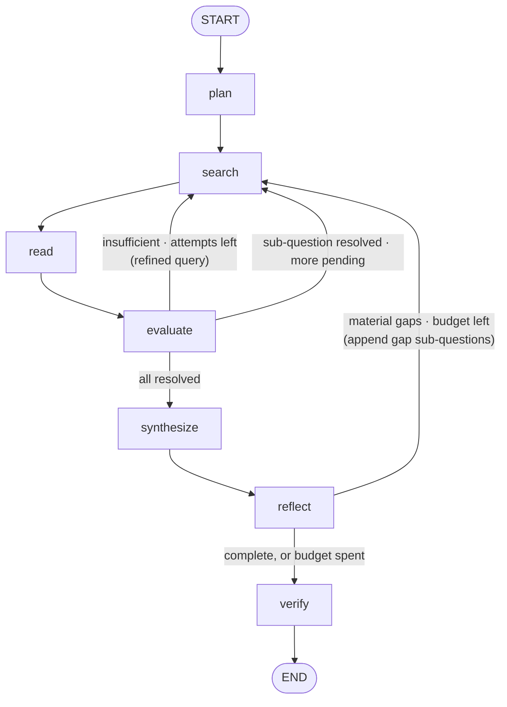

# Architecture

Given a research question, the agent plans sub-questions, researches each through capped search/read/evaluate loops, synthesizes a cited briefing, reflects on whether the original question was actually answered, and verifies that every claim traces to a retrieved source. The whole thing is one LangGraph `StateGraph`: **seven named nodes, two conditional routers, three loops — all capped.**

## The graph



**Why a graph instead of a tool-calling (ReAct) agent:** a ReAct loop buries planning, retry policy, and stopping conditions inside the prompt and trajectory — you can't see them, stream them, or grade them. Here every technique is a named node, control flow is data in the state (`sub_questions`, `cursor`, `attempts`) so the UI can render it live, and failure modes are bounded by construction.

## State

One shared `TypedDict`; each node returns a partial update. Overwrite semantics, no reducers — execution is strictly sequential. (Parallelizing with `Send` would require `operator.add` reducers on `sources`/`findings`; deliberately not done.)

```python
class ResearchState(TypedDict):
    question: str               # the user's question — read by everything
    sub_questions: list[SubQuestion]  # the plan; reflect may append
                                # (LangGraph forbids a node and a state key
                                #  sharing a name — the node is "plan")
    cursor: int                 # index of the sub-question being researched
    attempts: int               # search rounds spent on current sub-question
    last_query: str             # what search just ran (drives the UI)
    next_query: str | None      # refinement from evaluate, consumed by search
    results: list[SearchResult] # this round's hits (transient; read clears it)
    sources: list[Source]       # global registry — cited as [S1], [S2], …
    findings: list[Finding]     # compressed evidence notes with [S#] refs
    draft: str                  # briefing from synthesize
    reflection_rounds: int
    open_gaps: list[str]        # gaps reflect couldn't fill — disclosed, not dropped
    flagged: list[str]          # claims that failed the grounding audit
    final: str                  # draft + flags + Limitations section
    history: list[dict]         # prior Q/briefing pairs, for follow-ups

# SubQuestion = {id, question, rationale, status: pending|answered|thin}
# Source     = {id, url, title, content, via: playwright|tavily}
# Finding    = {sub_q_id, notes}  # bullets w/ inline [S#] and short quotes
```

**The invariant:** whoever moves `cursor` resets `attempts` to 0 and clears `next_query`. Nearly every loop bug violates this.

## Nodes

1. **`plan`** (1 LLM call) — decomposes the question into 3–5 sub-questions, each with a one-sentence `rationale`, ordered foundation-first. Sub-questions must be *independently answerable by a web search* — no cross-dependencies, which keeps the loop simple and the queries free. The plan is load-bearing everywhere downstream: it is the search agenda, evaluate's grading rubric, the briefing's outline, and reflection's mutation point.

2. **`search`** (0 LLM calls) — query = `next_query` if evaluate set one, else the current sub-question verbatim. Tavily, `max_results=5`, `include_raw_content=True`. No query-generation call: the planner writes searchable sub-questions, so first attempts are free.

3. **`read`** (≤2 LLM calls) — fetches the top 2 unseen results in relevance order (Playwright → trafilatura; falls back to Tavily `raw_content`, then snippet), registers each in `sources`, and immediately **compresses** each page into a `Finding`: bullets relevant to the current sub-question with 1–2 verbatim quotes and `[S#]` refs. Compress-at-read is both the context-blowup fix and what makes the grounding audit reliable — quotes are captured while the page is in context. Raw pages never travel past this node.

4. **`evaluate`** (1 LLM call) — judge and refine in one call: `{sufficient, missing, refined_query}`. Sufficient → mark `answered`, advance cursor. Insufficient with attempts left → store `next_query`. Attempts exhausted → mark `thin` and advance anyway — weak coverage becomes visible output, not an infinite loop.

5. **`synthesize`** (1 LLM call) — writes the briefing from findings only (never raw sources): executive summary → one section per sub-question in plan order, inline `[S#]` on every factual claim → numbered source list. `thin` sub-questions get explicitly hedged language. Re-runs wholesale after a gap round.

6. **`reflect`** (1 LLM call) — grades the **draft against the original question** (not the research trail — that would measure effort, not outcome). Output: `{answered, gaps}`. Gaps must be material to the original question; each is a new searchable sub-question. Appended gaps re-enter the normal search loop; `cursor` already points at them because it ran off the end of the old plan — zero special-case code. Budget exhausted with gaps remaining → gaps are disclosed in the briefing's Limitations section, never silently dropped.

7. **`verify`** (regex + 1 LLM call) — the grounding guardrail, two layers: (a) mechanical — every `[S#]` must resolve to a registered source, every factual paragraph needs ≥1 citation; deterministic, no model can talk past it. (b) LLM audit — each cited claim vs. the quote-bearing findings: `supported | partial | unsupported`. Failures are **flagged (`⚠ unverified`), not fixed** — no verify→search loop; re-researching at the last mile reopens unbounded work. Writes `final` = draft + flags + Limitations (thin coverage, unresolved gaps, unsupported claims).

## Control flow: routers and loops

Routers are pure functions of state — they never mutate (LangGraph silently discards router return values other than the route). All mutation happens in nodes.

- **after `evaluate`:** → `search` (retry with refined query, or next sub-question — state encodes which) | → `synthesize` (cursor ran off the plan)
- **after `reflect`:** → `search` (gaps appended, budget left) | → `verify`

| Loop | Cap (config.py) | Default |
|---|---|---|
| refine-and-retry per sub-question | `MAX_ATTEMPTS_PER_SUB_Q` | 3 |
| sub-question cursor | `MAX_SUB_QUESTIONS` | 5 |
| reflection gap rounds | `MAX_REFLECTION_ROUNDS` | 1 (+ ≤`MAX_GAP_QUESTIONS`=2 questions) |

Plus: `RESULTS_PER_SEARCH=5`, `READS_PER_SUB_Q=2`, `SOURCE_CHAR_LIMIT=8000`, `PAGE_TIMEOUT_S=15`. Worst case ≈ 21 searches / ~25 LLM calls, knowable before running. Typical run: 6–8 searches, ~17 calls, 2–5 minutes.

## Streaming

`graph.stream(state, stream_mode=["updates", "messages"])`:
- `updates` — `{node_name: state_delta}` per completed node → the live timeline (plan checklist, `🔍 query`, `📄 source`, verdicts, flags).
- `messages` — token stream, filtered to `metadata["langgraph_node"] == "synthesize"` → the briefing types itself out progressively.

The CLI and the Streamlit UI consume the identical stream. In Streamlit the run is one blocking loop within a single script run, results pinned to `st.session_state` (Streamlit reruns the whole script per interaction — no threads, no async).

## Follow-up questions

Same graph, re-invoked. `sources`, `findings`, and `history` persist in session state; the planner's follow-up mode emits 1–2 sub-questions targeting only what's new; source numbering continues so citations stay stable across rounds. No second agent, no checkpointer.

## Repo structure

```
research-assistant-agent/
├── agent/
│   ├── config.py     # keys (dotenv), model id, all loop caps        [phase 0 ✓]
│   ├── llm.py        # Gemini client + structured() — the one model
│   │                 #   seam; __main__ is the smoke test            [phase 0 ✓]
│   ├── state.py      # ResearchState + TypedDict output schemas      [phase 1 ✓]
│   ├── nodes.py      # node functions + routers + their prompts      [phases 1 ✓ – 4]
│   ├── graph.py      # build_graph(): wiring only, ~30 lines         [phase 1 ✓]
│   └── tools.py      # tavily_search(), read_page(), dev cache       [phases 1 ✓, 3]
├── cli.py            # dev runner / stream printer                   [phase 1 ✓]
├── app.py            # Streamlit UI                                  [phase 5]
├── test_graph.py     # offline control-flow tests                    [phases 1 ✓, 2]
├── test_verify.py    # fabricated-claim guardrail regression test    [phase 4]
├── CLAUDE.md · architecture.md · project_spec.md
├── requirements.txt · .env.example · .env (gitignored)
└── README.md         # graph diagram, demo GIF                       [phase 6]
```

`nodes.py` stays one file so the agent reads top-to-bottom — a portfolio feature, not laziness. Split only past ~400 lines.

## Design decisions, indexed

- **Graph over ReAct** — control flow visible, streamable, bounded.
- **Compress at read time** — downstream nodes see findings, never pages; quotes make the audit reliable.
- **Refine folded into evaluate** — one judgment call, half the LLM calls, no extra node.
- **First query = sub-question verbatim** — planning quality makes query generation free.
- **Gaps append to the plan** — reflection reuses the whole research loop with no special path.
- **Verify flags, never re-researches** — honesty over unbounded perfection at the last mile.
- **`thin` status instead of endless retries** — weak coverage is disclosed, not hidden.
- **Sequential, not parallel** — the streamed narrative is the product; `Send` fan-out would garble it.
- **Native structured output (Gemini)** — deletes the JSON parse/retry layer entirely; schemas are flat TypedDicts.
- **All model I/O normalized at the seam** — `llm.py` wraps every call in retry-on-5xx, and `text_of()` flattens the newer models' content-part lists to plain text; no node or UI code ever handles either concern.
